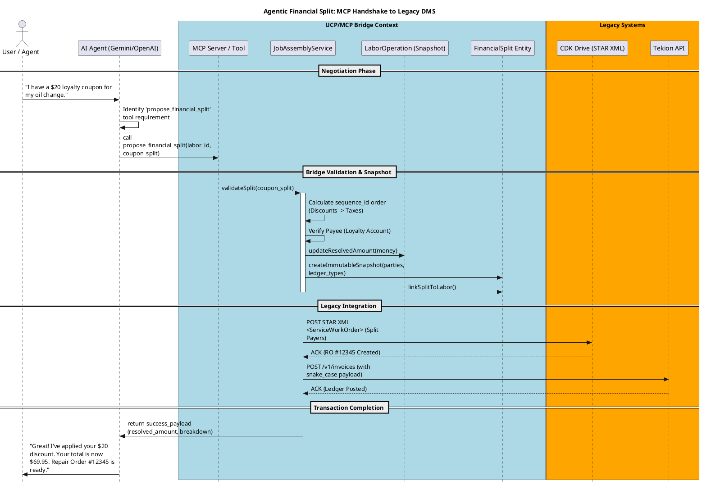

Here is the **PlantUML Sequence Diagram** representing the end-to-end flow. It illustrates how the AI Agent uses the **MCP Tool** to interact with your **UCP Bridge**, which then snapshots the **Financial Split** and persists the data into **Legacy DMS** environments like CDK and Tekion.

### Why this flow is defensible:

1. **Isolation:** The AI never talks to the DMS directly. It talks to the `MCP Tool`, which enforces your business logic.
2. **Immutability:** Once the `Service` creates the `Split` snapshot, that record is locked. Even if the dealer deletes the loyalty program tomorrow, the audit trail for this specific `labor_id` remains intact.
3. **Cross-Platform:** The same `FinancialSplit` logic generates both the **STAR XML** for the old-school CDK mainframe and the **REST JSON** for the modern Tekion cloud.

**Would you like me to generate a "Transformation Class" in Java that handles the mapping logic between the `FinancialSplit` and the CDK STAR XML `<Financial>` segment?**